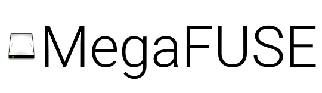

An open source implementation of the Mega Cloud service as a FUSE filesystem

⚠ WARNING: MegaFUSE is still in alpha! Use at your own risk until a beta version has been released!

`"Mega" is a registered trademark of Mega Limited.`

## The Stack

* [https://github.com/dokan-dev/dokany](Dokany)
* [https://github.com/dokan-dev/dokan-dotnet](Dokan.Net)
* [https://github.com/gpailler/MegaApiClient](MegaApiClient)

## License

MegaFUSE is licensed under the GNU GPLv3 License. A copy can be found at FSF.org